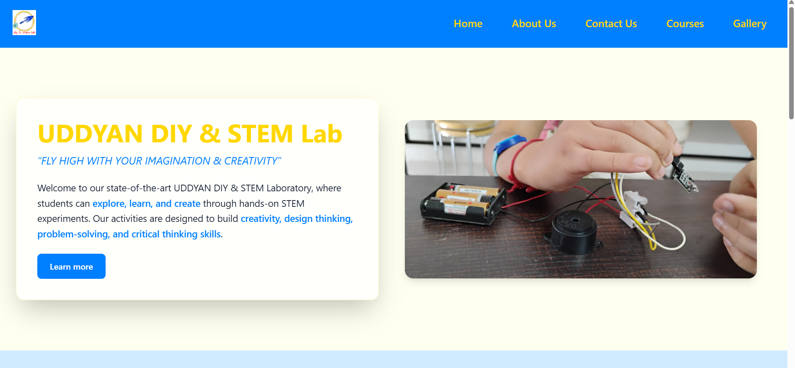
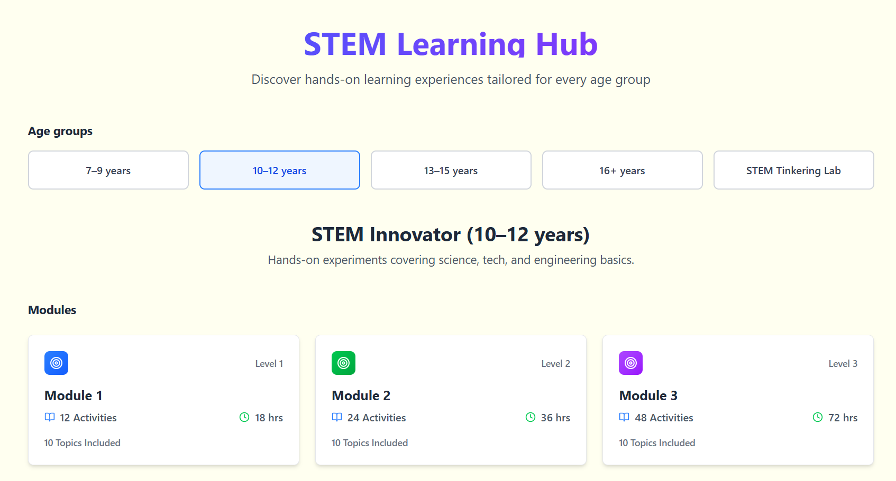
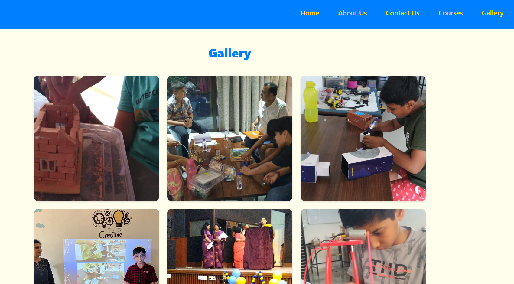

# 🧪 DIY STEM Lab E-commerce Platform (2025)

https://uddyanstem.vercel.app/

A full-stack e-commerce platform built for a real-world client DIY STEM Lab store. The application enables course listing, content management, and seamless media handling using Cloudinary, with scalable deployment on modern cloud platforms.

---

## 🚀 Deployment
- Frontend: [Deployed on Vercel](#)
- Backend API: [Deployed on Render](#)

---

## 📸 Screenshots

### 🏠 Home Page

### 🛍️ Course Listing Page

### 🧑‍💻 Gallery

---

## 🛠️ Tech Stack

**Frontend:**
- React.js
- Tailwind CSS / CSS3
- Axios

**Backend:**
- Node.js
- Express.js
- MongoDB

**Cloud & Dev Tools:**
- Cloudinary (Image Storage)
- Vercel (Frontend Deployment)
- Render (Backend Deployment)
- Git & GitHub

---

## ✨ Features

- 🛒 Product listing and dynamic updates
- 🧑‍💼 Admin panel for content management
- ☁️ Cloud-based image upload using Cloudinary
- ⚡ Fast and responsive UI
- 🌐 Fully deployed full-stack architecture
- 🔐 Secure API-based communication between frontend and backend

---

## 🧩 Architecture Overview
